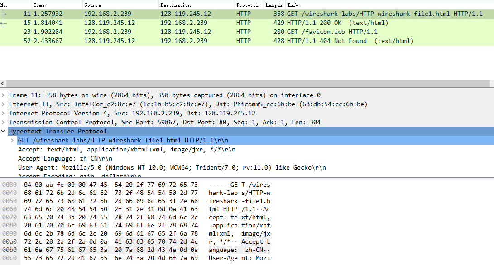
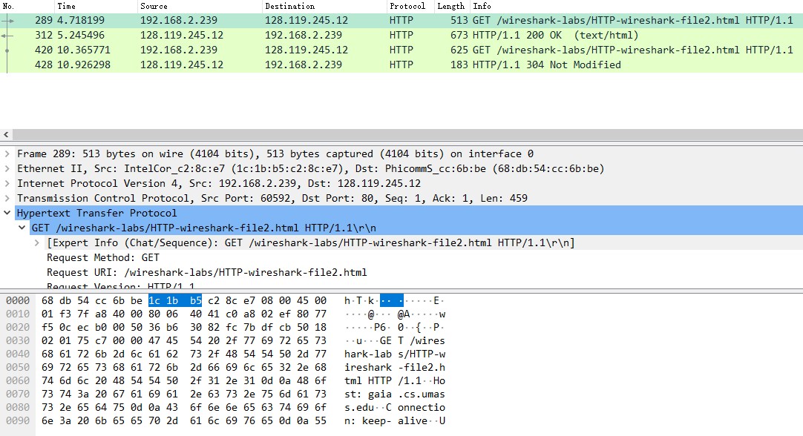
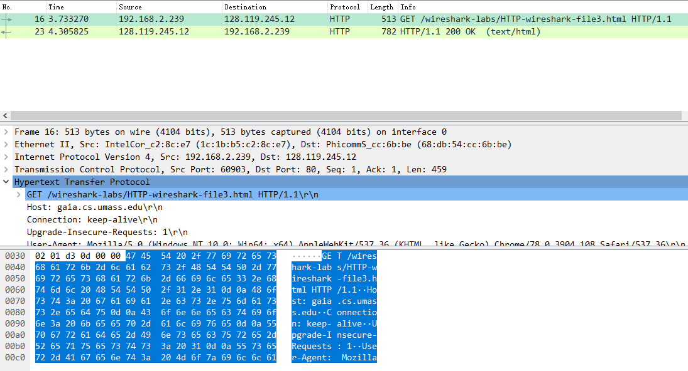

### 1.基本HTTP GET/response交互

* 实验图像


```
    GET /wireshark-labs/HTTP-wireshark-file1.html HTTP/1.1\r\n
    Accept: text/html, application/xhtml+xml, image/jxr, */*\r\n
    Accept-Language: zh-CN\r\n
    User-Agent: Mozilla/5.0 (Windows NT 10.0; WOW64; Trident/7.0; rv:11.0) like Gecko\r\n
    Accept-Encoding: gzip, deflate\r\n
    Host: gaia.cs.umass.edu\r\n
    Connection: Keep-Alive\r\n
    \r\n
    [Full request URI: http://gaia.cs.umass.edu/wireshark-labs/HTTP-wireshark-file1.html]
    [HTTP request 1/1]
    [Response in frame: 15]
```
```
    HTTP/1.1 200 OK\r\n
    Server:   \r\n
    Date: Mon, 02 Dec 2019 13:44:52 GMT\r\n
    Content-Type: text/html; charset=UTF-8\r\n
    Content-Length: 128\r\n
    Connection: keep-alive\r\n
    Last-Modified: Mon, 02 Dec 2019 06:59:01 GMT\r\n
    ETag: "80-598b31d50a6e7"\r\n
    Accept-Ranges: bytes\r\n
    \r\n
    [HTTP response 1/1]
    [Time since request: 0.556109000 seconds]
    [Request in frame: 11]
    [Request URI: http://gaia.cs.umass.edu/wireshark-labs/HTTP-wireshark-file1.html]
    File Data: 128 bytes
    
    <html>\n
    Congratulations.  You've downloaded the file \n
    http://gaia.cs.umass.edu/wireshark-labs/HTTP-wireshark-file1.html!\n
    </html>\n
```
1. 您的浏览器是否运行HTTP版本1.0或1.1？服务器运行什么版本的HTTP？  
浏览器和服务器都运行 HTTP/1.1  

2. 您的浏览器会从接服务器接受哪种语言（如果有的话）？  
Accept-Language: zh-CN  

3. 您的计算机的IP地址是什么？ gaia.cs.umass.edu服务器地址呢？  
计算机IP 192.168.2.239  
gaia.cs.umass.edu服务器IP 128.119.245.12  

4. 服务器返回到浏览器的状态代码是什么？  
200 OK  

5. 服务器上HTML文件的最近一次修改是什么时候？  
Last-Modified: Mon, 02 Dec 2019 06:59:01 GMT  

6. 服务器返回多少字节的内容到您的浏览器？  
Content-Length: 128

7. 通过检查数据包内容窗口中的原始数据，你是否看到有协议头在数据包列表窗口中未显示？ 如果是，请举一个例子。  
应该没有  

### 2.HTTP条件Get/response交互

* 实验图像
  

```
    GET /wireshark-labs/HTTP-wireshark-file2.html HTTP/1.1\r\n
    Host: gaia.cs.umass.edu\r\n
    Connection: keep-alive\r\n
    Upgrade-Insecure-Requests: 1\r\n
    User-Agent: Mozilla/5.0 (Windows NT 10.0; Win64; x64) AppleWebKit/537.36 (KHTML, like Gecko) Chrome/78.0.3904.108 Safari/537.36\r\n
    Accept: text/html,application/xhtml+xml,application/xml;q=0.9,image/webp,image/apng,*/*;q=0.8,application/signed-exchange;v=b3\r\n
    Accept-Encoding: gzip, deflate\r\n
    Accept-Language: zh-CN,zh;q=0.9\r\n
    \r\n
    [Full request URI: http://gaia.cs.umass.edu/wireshark-labs/HTTP-wireshark-file2.html]
    [HTTP request 1/2]
    [Response in frame: 312]
    [Next request in frame: 420]
```

```
    HTTP/1.1 200 OK\r\n
    Server:   \r\n
    Date: Mon, 02 Dec 2019 14:14:09 GMT\r\n
    Content-Type: text/html; charset=UTF-8\r\n
    Content-Length: 371\r\n
    Connection: keep-alive\r\n
    Last-Modified: Mon, 02 Dec 2019 06:59:01 GMT\r\n
    ETag: "173-598b31d509f17"\r\n
    Accept-Ranges: bytes\r\n
    \r\n
    [HTTP response 1/2]
    [Time since request: 0.527297000 seconds]
    [Request in frame: 289]
    [Next request in frame: 420]
    [Next response in frame: 428]
    [Request URI: http://gaia.cs.umass.edu/wireshark-labs/HTTP-wireshark-file2.html]
    File Data: 371 bytes
    \n
    <html>\n
    \n
    Congratulations again!  Now you've downloaded the file lab2-2.html. <br>\n
    This file's last modification date will not change.  <p>\n
    Thus  if you download this multiple times on your browser, a complete copy <br>\n
    will only be sent once by the server due to the inclusion of the IN-MODIFIED-SINCE<br>\n
    field in your browser's HTTP GET request to the server.\n
    \n
    </html>\n
```

```
    GET /wireshark-labs/HTTP-wireshark-file2.html HTTP/1.1\r\n
    Host: gaia.cs.umass.edu\r\n
    Connection: keep-alive\r\n
    Cache-Control: max-age=0\r\n
    Upgrade-Insecure-Requests: 1\r\n
    User-Agent: Mozilla/5.0 (Windows NT 10.0; Win64; x64) AppleWebKit/537.36 (KHTML, like Gecko) Chrome/78.0.3904.108 Safari/537.36\r\n
    Accept: text/html,application/xhtml+xml,application/xml;q=0.9,image/webp,image/apng,*/*;q=0.8,application/signed-exchange;v=b3\r\n
    Accept-Encoding: gzip, deflate\r\n
    Accept-Language: zh-CN,zh;q=0.9\r\n
    If-None-Match: "173-598b31d509f17"\r\n
    If-Modified-Since: Mon, 02 Dec 2019 06:59:01 GMT\r\n
    \r\n
    [Full request URI: http://gaia.cs.umass.edu/wireshark-labs/HTTP-wireshark-file2.html]
    [HTTP request 2/2]
    [Prev request in frame: 289]
    [Response in frame: 428]
```

```
    HTTP/1.1 304 Not Modified\r\n
    Server:   \r\n
    Date: Mon, 02 Dec 2019 14:14:14 GMT\r\n
    Connection: keep-alive\r\n
    ETag: "173-598b31d509f17"\r\n
    \r\n
    [HTTP response 2/2]
    [Time since request: 0.560527000 seconds]
    [Prev request in frame: 289]
    [Prev response in frame: 312]
    [Request in frame: 420]
    [Request URI: http://gaia.cs.umass.edu/wireshark-labs/HTTP-wireshark-file2.html]
```

8. 检查第一个从您浏览器到服务器的HTTP GET请求的内容。您在HTTP GET中看到了“IF-MODIFIED-SINCE”行吗？  
没看到  

9. 检查服务器响应的内容。服务器是否显式返回文件的内容？ 你是怎么知道的？  
服务器显式返回了文件内容，在实体部分可以看到  

10. 现在，检查第二个HTTP GET请求的内容。 您在HTTP GET中看到了“IF-MODIFIED-SINCE:”行吗？ 如果是，“IF-MODIFIED-SINCE:”头后面包含哪些信息？  
If-Modified-Since: Mon, 02 Dec 2019 06:59:01 GMT\r\n  
包含了本地保存的文件的在服务器上的最后修改时间  

11. 针对第二个HTTP GET，从服务器响应的HTTP状态码和短语是什么？服务器是否明确地返回文件的内容？请解释。  
304 Not Modified  
服务器没有明确返回文件内容，因为文件后来没有被修改。

### 3.检索长文件

* 实验图像
   

```
    GET /wireshark-labs/HTTP-wireshark-file3.html HTTP/1.1\r\n
    Host: gaia.cs.umass.edu\r\n
    Connection: keep-alive\r\n
    Upgrade-Insecure-Requests: 1\r\n
    User-Agent: Mozilla/5.0 (Windows NT 10.0; Win64; x64) AppleWebKit/537.36 (KHTML, like Gecko) Chrome/78.0.3904.108 Safari/537.36\r\n
    Accept: text/html,application/xhtml+xml,application/xml;q=0.9,image/webp,image/apng,*/*;q=0.8,application/signed-exchange;v=b3\r\n
    Accept-Encoding: gzip, deflate\r\n
    Accept-Language: zh-CN,zh;q=0.9\r\n
    \r\n
    [Full request URI: http://gaia.cs.umass.edu/wireshark-labs/HTTP-wireshark-file3.html]
    [HTTP request 1/1]
    [Response in frame: 23]
```

```
Frame 23: 782 bytes on wire (6256 bits), 782 bytes captured (6256 bits) on interface 0
Ethernet II, Src: PhicommS_cc:6b:be (68:db:54:cc:6b:be), Dst: IntelCor_c2:8c:e7 (1c:1b:b5:c2:8c:e7)
Internet Protocol Version 4, Src: 128.119.245.12, Dst: 192.168.2.239
Transmission Control Protocol, Src Port: 80, Dst Port: 60903, Seq: 4023, Ack: 460, Len: 728
[4 Reassembled TCP Segments (4750 bytes): #20(1460), #21(1460), #22(1102), #23(728)]
    [Frame: 20, payload: 0-1459 (1460 bytes)]
    [Frame: 21, payload: 1460-2919 (1460 bytes)]
    [Frame: 22, payload: 2920-4021 (1102 bytes)]
    [Frame: 23, payload: 4022-4749 (728 bytes)]
    [Segment count: 4]
    [Reassembled TCP length: 4750]
    [Reassembled TCP Data: 485454502f312e3120323030204f4b0d0a5365727665723a…]
Hypertext Transfer Protocol
    HTTP/1.1 200 OK\r\n
    Server:   \r\n
    Date: Mon, 02 Dec 2019 14:37:48 GMT\r\n
    Content-Type: text/html; charset=UTF-8\r\n
    Content-Length: 4500\r\n
    Connection: keep-alive\r\n
    Last-Modified: Mon, 02 Dec 2019 06:59:01 GMT\r\n
    ETag: "1194-598b31d5031b6"\r\n
    Accept-Ranges: bytes\r\n
    \r\n
    [HTTP response 1/1]
    [Time since request: 0.572555000 seconds]
    [Request in frame: 16]
    [Request URI: http://gaia.cs.umass.edu/wireshark-labs/HTTP-wireshark-file3.html]
    File Data: 4500 bytes
Line-based text data: text/html (98 lines)
```

12. 您的浏览器发送多少HTTP GET请求消息？哪个数据包包含了美国权利法案的消息？  
只发送了一个HTTP GET请求消息。  
返回的四个TCP数据包都包含了美国权利法案的消息。  

13. 哪个数据包包含响应HTTP GET请求的状态码和短语？
返回的第一个TCP数据包包含响应HTTP GET请求的状态码和短语  

14. 响应中的状态码和短语是什么？  
200 OK  

15. 需要多少包含数据的TCP段来执行单个HTTP响应和权利法案文本？  
需要4个TCP数据包  

### 4.具有嵌入对象的HTML文档  


