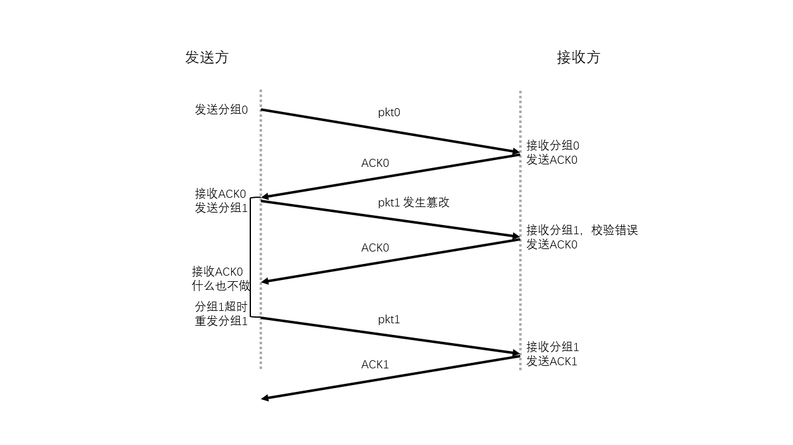
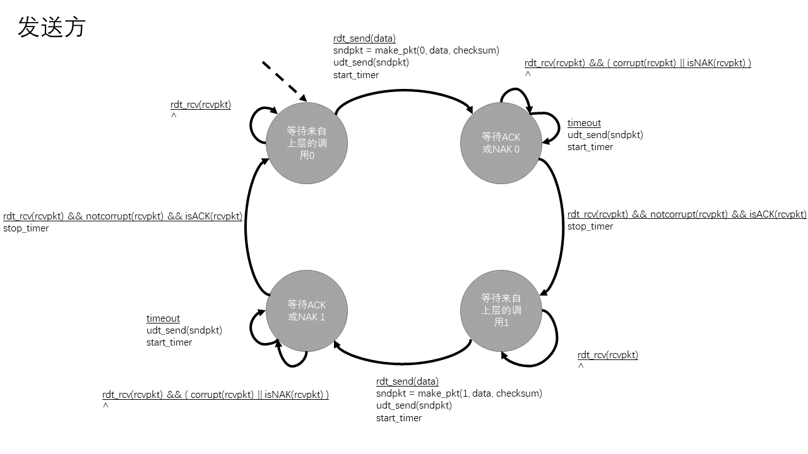
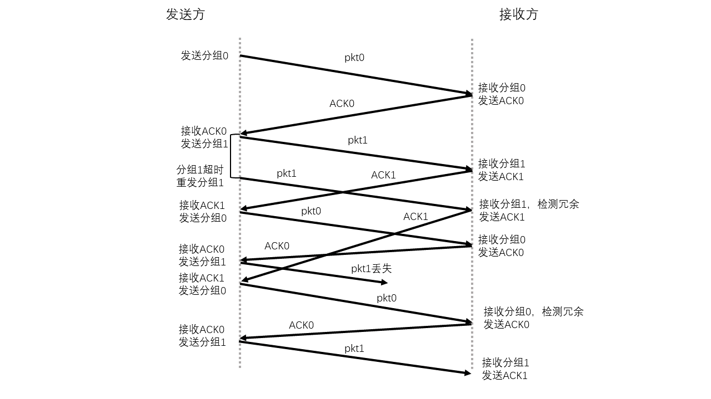
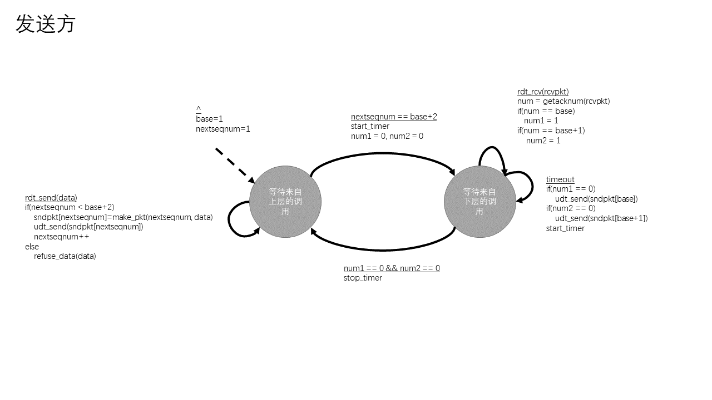
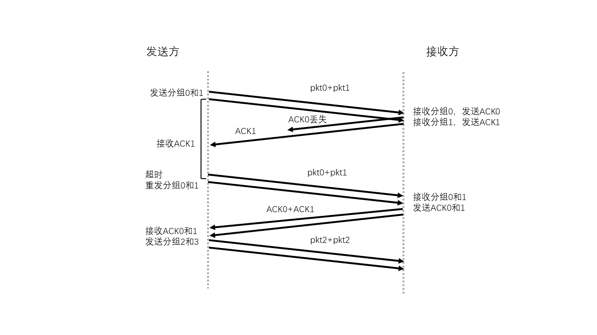
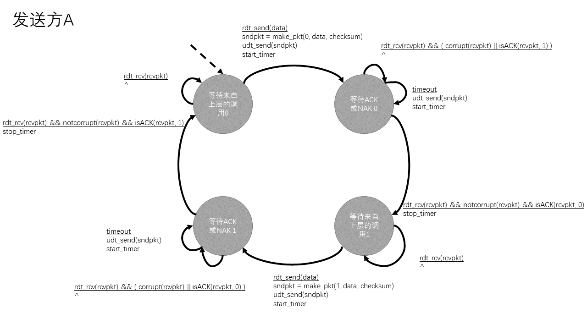
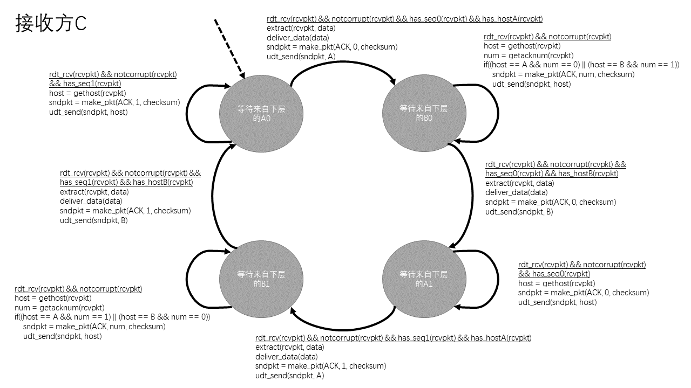
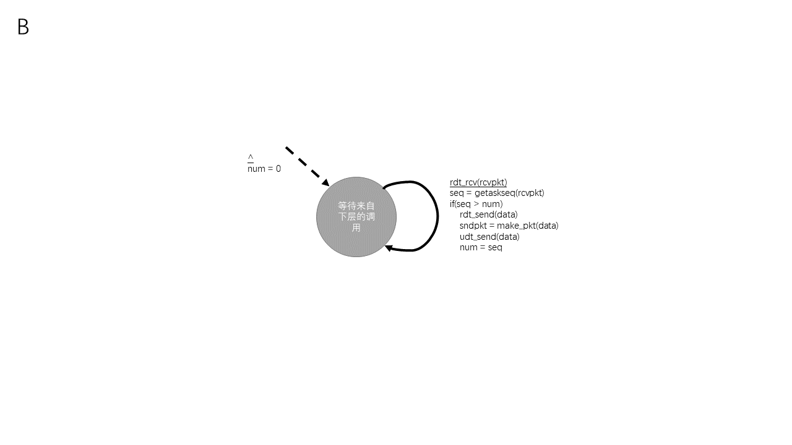

* **P1**  
设主机A的telnet会话端口号为x，主机B的telnet会话端口号为y  
a. 源端口号：x，目的端口号：23  
b. 源端口号：y，目的端口号：23  
c. 源端口号：23，目的端口号：x  
d. 源端口号：23，目的端口号：y  
e. 可能相同  
f. 不可能相同  

* **P2**  
服务器到客户A:  
源端口号:80, 目的端口号:26145, 源IP:B, 目的IP:A  
服务器到客户C，会话1:  
源端口号:80, 目的端口号:7532, 源IP:B, 目的IP:C  
服务器到客户C，会话2:  
源端口号:80, 目的端口号:26145, 源IP:B, 目的IP:C  

* **P3**  
01010011+01100110=10111001  
10111001+01110100=00101110  
反码为 11010001  
使用反码对接收方非常方便，只需将所有数据包含校验码加起来，计算和为全1即可。  
如果不是全1则说明出现了差错。  
1比特的差错肯定可以检查出，2比特的差错存在检测不出的情况。  

* **P4**  
a. 00111110  
b. 10111111  
c. 两个字节的最后一位变化: 01011101 01100100  

* **P5**  
接收方不能完全确认没有比特差错，如P4c题目所示，出现多个差错时存在检测不出的情况  

* **P6**  
发送方发送序号0的报文，进入等待ACK0状态。接收方收到，并且回复ACK，进入等待状态1。
回复的ACK受损了。此时发送方重传报文0，接收方收到报文0，认为序号不对，回复NAK。
发送方收到NAK，发送方重传报文0，接收方依然认为序号不对，回复NAK。  
产生死锁。

* **P7**  
因为ACK和确认序号已经可以完整的标识这个分组，而且ACK的缺失会导致重传，因此最终ACK可以确保到达。  

* **P8**  
与rdt2.2的接收方相同  

* **P9**  
数据分组发生篡改时：  
  
确认分组发生篡改时：  
  

* **P10**  
如果不使用NAK，则协议正如rdt3.0所示。  
如果使用NAK，则协议如下：  
  
接收方与rdt2.1接收方相同  

* **P11**  
1. 在等待来自下层的1中删除  
会正常工作。因为上一步状态转换时已经生成了sndpkt  
2. 在等待来自下层的0中删除  
在第一次进入时，会工作不正常。此时sndpkt还没有生成，如果接收了一个校验错误的报文，那么无法返回一个分组。  

* **P12**  
如果定时器正常，那么协议可以正常运行。  
如果定时器过早超时：  
1. 发送1报文。
2. 首先超时，重传1次。
3. 收到ACK报文，发送2报文。
4. 收到上一个ACK报文，重传1次。
5. 超时，重传2次。
6. 收到ACK报文，发送3报文。
7. 收到上一个ACK报文，重传1次。
8. 收到上一个ACK报文，重传2次。
9. 超时，重传3次。
10. 收到ACK报文，发送4报文。  
....  
对于第n个分组，重传n次。  

* **P13**  
无法工作的一个例子：
  
中间两个报文没有被接收方正确接收就继续发送下面的报文了。  

* **P14**  
1. 不合适。因为发送端如果接收不到数据，无法判定是丢包还是正确接收了。  
2. 不存在丢包的情况下，采用停等协议不适合使用只用NAK的协议。因为发送方必须等待最长的RTT时间，才能确认接收方已经收到。因此相比于ACK协议，时间的花费会更长。  
不存在丢包的情况下，如果采用流水线协议，那么发送方发送的报文如果损坏，接收方无法判断其序号，无法发送NAK报文，发送方会认为这个报文已经正确接收。因此发生错误。  
如果存在少量丢包的情况下，那么只用NAK的协议就更不如使用ACK的协议了  

* **P15**  
L/R = 15 * 8000 / 109 = 0.012  
U = X(L/R) / (RTT + L/R) = 0.9  
X ~= 2251

* **P16**  
可以增加信道利用率，因为发送方接收到大量的ACK，便认为发送的报文已经被正确接收了，然后继续发送后续报文。  
问题：如果发生丢包，损坏等现象，那么接收到的数据是不完整的。

* **P17**  
   
  

* **P18**  
报文格式:与SR协议相同  
   
  
  

* **P19**  
报文格式与rdt3.0相比，增加了一个指示ACK报文的来源字段，值为B或C  
   
   

* **P20**  
报文格式与rdt3.0相比，增加了一个指示数据报文的来源字段，值为A或B  
   
   

* **P21**  
   
   

* **P22**  

