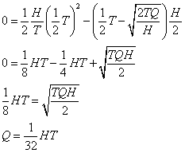
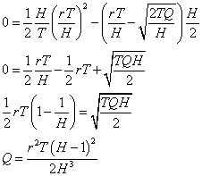
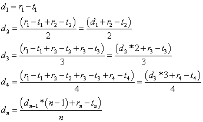

* **P1**  
a. 1，4，5，6块能够及时播放。通过画一个第一块一到达就开始播放的折线图来得出。  
b. 1，4，5，6块能够及时播放。通过画一个t1+Δ开始播放的折线图来得出。  
c. 缓存最多为2。通过视频接收和播放的折线图的差的最大值就能得到。  
d. 最小的播放时延为3Δ。通过使得视频接收和播放的折线图不重合的最小时延值求得。

* **P2**  
播放期长度：Q/(r-x)  
停滞期长度：(B-Q)/(x-r)  

* **P3**  
a. 平均发送速率为H/2。  
b. 这要看播放的速率和H的关系，以及快的大小。  
如果块相对于重复周期较小，以至于收到第一个块播放完成之后的收不到第二个块，那么就会发生停滞。  
c.   
   
d. 当H=2r时，此时在时间T正好播放(1/2)HT的内容，也正好传输进(1/2)HT。  
在Q=HT/2时，播放完Q中的内容后，正好时间到T，此时又传输进(1/2)HT的内容，远远满足播放条件，可以进行播放。  
因此每个播放循环中都不会停滞。  
e. 由于H>2r，因此开始播放的时间不会晚于(1/2)T。设H=2r。  
设在时间t开始播放，那么0-t时是积累Q的阶段，t-(1/2)T 时间是消耗Q的阶段，需要保证消耗的小于等于Q。  
假设消耗的等于Q，那么到(1/2)T 时间后就开始积累字节，一直到时间T。通过观察图像的面积，可以发现积累的面积正好能够填补后面一个低值的空缺，使得后面的所有循环都变为一个H/2的直线。  
   
这也是一个上界，由于H>2r，实际上不到(1/2)T 的时间就开始积累字节了。  
   
这应该是确界。  
f.  当H=2r时，除非Q过大，或者B过小（例如小于(1/2)HT）否则一般不会变满。  
当H>2r时,我认为参数必须加上r，否则无法正确计算。  
我们来简单计算，省略Q带来的比特率波动，使得开始播放时从位置0开始。  
   

* **P4**  
疑问：不应该是压缩率为r，应该是消耗率为r  
a. 浪费了 E(x-r)  
b. 浪费了  
   

* **P5**  
a. N2  
b. 2N  

* **P6**  
书上翻译错误，是ms而不是秒。  
例子使用7.3.1节第二段的例子。  
a. 20ms 发送 160+h B  
速率为 64000+400h bps  
b. 书上并没有讲RTP的首部长度，通过查询网络，得知RTP首部为12字节。  
首部总长度为 12 + 20 + 8 = 40字节  

* **P7**  
设初值为d0  
a.  
   
b.  
设初值为d0  
   

* **P8**  
设初值为v0  
a.  
   
b.  
   

* **P9**  
a.  
  
b.  
因为随着传输时间的增加，每个时延的占比越来越小，而且占比是平均的。但是现实中，网络时延是可能根据时间变化的，距离最近的时间的时延对我们估计当前的平均时延更有帮助一些，因此不采用a中的方法。  

* **P10**  